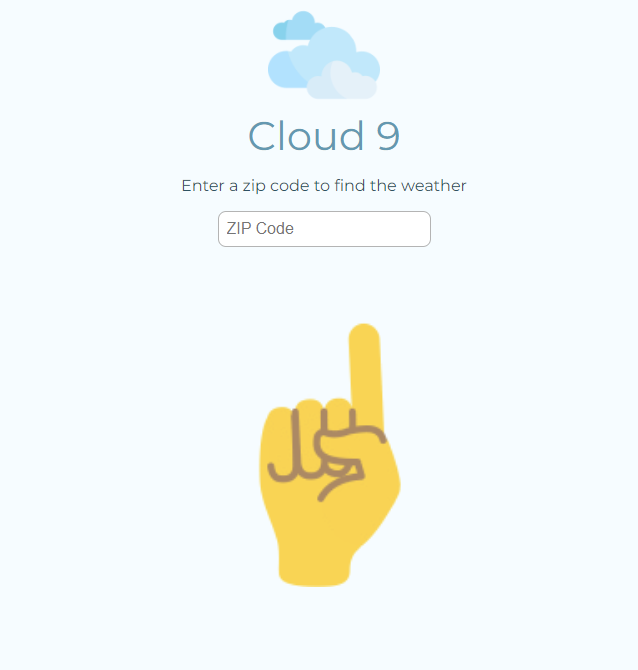
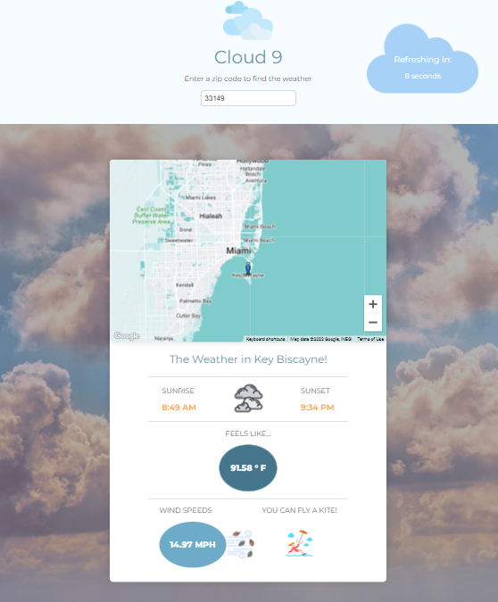
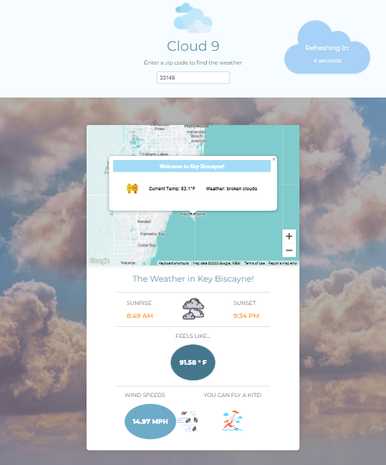

# Cloud 9

A fun weather app that lets you check the weather by entering your zip code. a background image will be dynamically rendered depending on the weather of the location, and a google map will show you the exact location of the zip code on a map. Furthermore, the app will tell you the wind speeds of the location - depicting if you should fly a kite or not. 

## Run the app locally
1) Clone the repository and open it on your source code editor
2) cd into the relevant project folder
3) Install dependencies in the client and server directories
`npm install`
4) Run command to start the app in development mode
`npm start`
5) You are ready to go!

## Tech Stack
This application was built on TypeScript and Sass leveraging the Open Weather API & Google Maps API